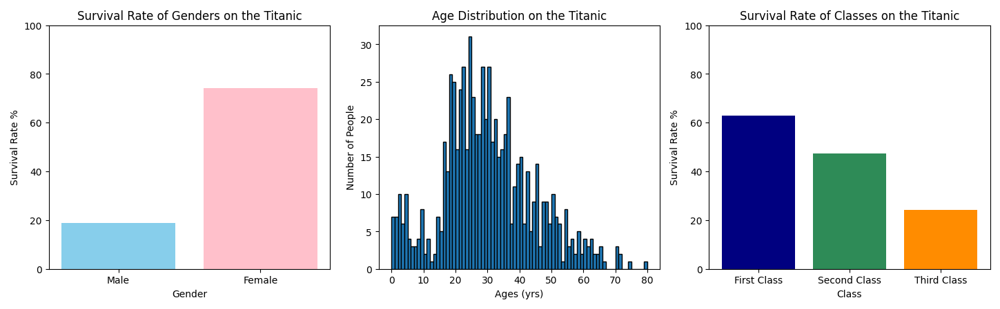

# TitanicDataAnalysis


[](titanic_data.csv)

## Printed Info

When the program is run, the entire dataset is displayed like this

| PassengerId | Survived | Pclass | Name                                              | Sex    | Age | SibSp | Parch | Ticket            | Fare     | Cabin | Embarked | FamilySize |
|-------------|----------|--------|---------------------------------------------------|--------|-----|-------|-------|-------------------|----------|-------|----------|------------|
| 1           | 0        | 3      | Braund, Mr. Owen Harris                           | male   | 22  | 1     | 0     | A/5 21171         | 7.25     |       | S        | 2          |
| 2           | 1        | 1      | Cumings, Mrs. John Bradley(Florence Briggs Thayer)| female | 38  | 1     | 0     | PC 17599          | 71.2833  | C85   | C        | 2          |
| 3           | 1        | 3      | Heikkinen, Miss. Laina                            | female | 26  | 0     | 0     | STON/O2. 3101282  | 7.925    |       | S        | 1          |
| 4           | 1        | 1      | Futrelle, Mrs. Jacques Heath(Lily May Peel)       | female | 35  | 1     | 0     | 113803            | 53.1     | C123  | S        | 2          |
| 5           | 0        | 3      | Allen, Mr. William Henry                          | male   | 35  | 0     | 0     | 373450            | 8.05     |       | S        | 1          |
| 6           | 0        | 3      | Moran, Mr. James                                  | male   |     | 0     | 0     | 330877            | 8.4583   |       | Q        | 1          |
| 7           | 0        | 1      | McCarthy, Mr. Timothy J                           | male   | 54  | 0     | 0     | 17463             | 51.8625  | E46   | S        | 1          |
| 8           | 0        | 3      | Palsson, Master. Gosta Leonard                    | male   | 2   | 3     | 1     | 349909            | 21.075   |       | S        | 5          |
| 9           | 1        | 3      | Johnson, Mrs. Oscar W (Elisabeth Vilhelmina Berg) | female | 27  | 0     | 2     | 347742            | 11.1333  |       | S        | 3          |
| 10          | 1        | 2      | Nasser, Mrs. Nicholas(Adele Achem)                | female | 14  | 1     | 0     | 237736            | 30.0708  |       | C        | 2          |

Additionally, other data values are dynamically computed and displayed like this

``` txt
Survival Rate: 38.4%
Male Survival Rate: 18.9%
Female Survival Rate: 74.2%
Average Age: 23.8
Average Age Amongst Survivors: 24.0
Average Age Amongst Non-Survivors: 23.7
Oldest Passenger: 80.0
Youngest Passenger: 0.4
First Class Survival Rate: 0.63%
Second Class Survival Rate: 0.47%
Third Class Survival Rate: 0.24%
Highest Survival Rate Class: 1
First Class Average Fare: $84.15
Second Class Average Fare: $20.66
Third Class Average Fare: $13.68
Survival Rate Based on Family Size:
         1. 30.4%
         2. 55.3%
         3. 57.8%
         4. 72.4%
         5. 20.0%
         6. 13.6%
         7. 33.3%
         8. 0.0%
         9. None Applicable
        10. None Applicable
        11. 0.0%
It is better to travel with family
```

## Graph of Data

This graph is shown using matplotlib when the program is run


## Data Values

Other data values are calculated and are written to an [analysis file](analysis.txt) that looks like this

```yaml
Titanic Data Analysis

All Passengers:
    Population: 891
        Survivors: 342
        Deceased: 549
    Survival Rate: 38.4%
Genders:
    Male:
        Population: 577
            Survivors: 109
            Deceased: 468
        Survival Rate: 18.9%
    Female:
        Population: 314
            Survivors: 233
            Deceased: 81
        Survival Rate: 74.2%
Classes:
    First Class:
        Population: 216
            Survivors: 136
            Deceased: 80
        Survival Rate: 63.0%
    Second Class:
        Population: 184
            Survivors: 87
            Deceased: 97
        Survival Rate: 47.3%
    Third Class:
        Population: 491
            Survivors: 119
            Deceased: 372
        Survival Rate: 24.2%
Age Groups:
    Child (<18):
        Population: 113
            Survivors: 61
            Deceased: 52
        Survival Rate: 54.0%
    Adult (18-60):
        Population: 575
            Survivors: 222
            Deceased: 353
        Survival Rate: 38.6%
    Seniors (>60):
        Population: 575
            Survivors: 222
            Deceased: 353
        Survival Rate: 38.6%
Family Sizes:
    1. 30.4%
    2. 55.3%
    3. 57.8%
    4. 72.4%
    5. 20.0%
    6. 13.6%
    7. 33.3%
    8. 0.0%
    9. None Applicable
    10. None Applicable
    11. 0.0%

Highest Survival Rate Group:
    Gender: Female
    Class: First
    Age Group: Child
    Family Size: 4
```
